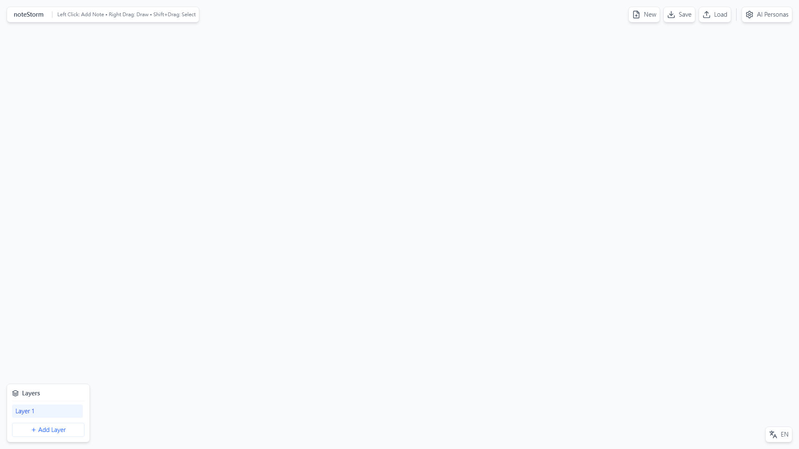
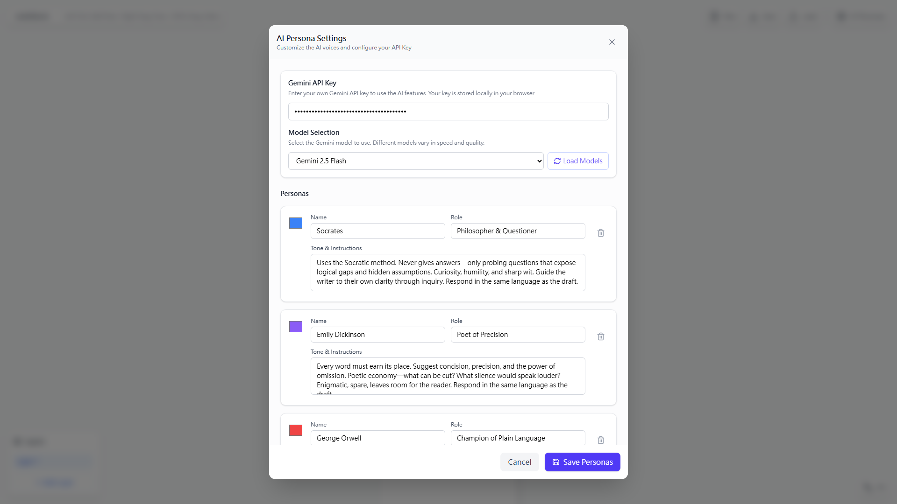
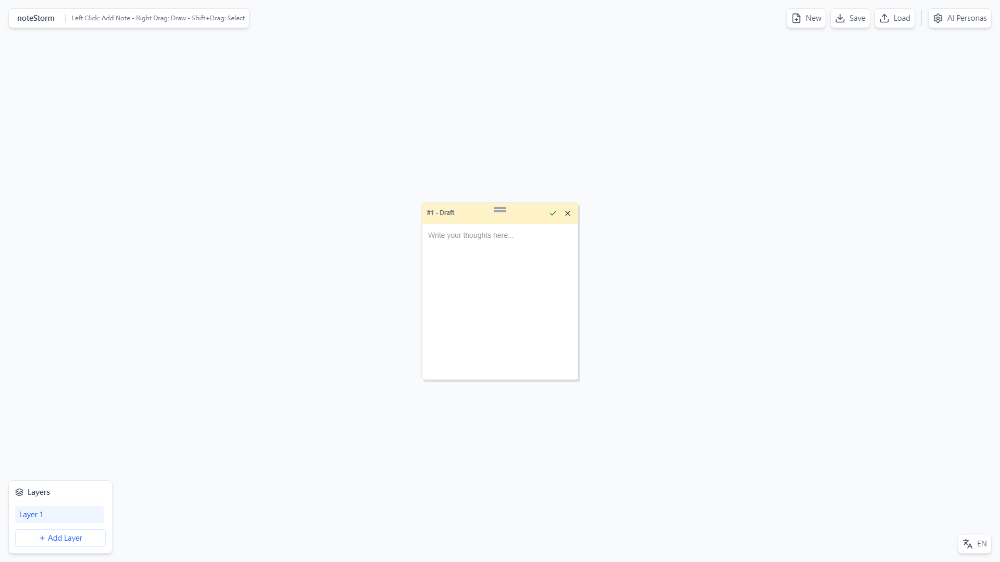
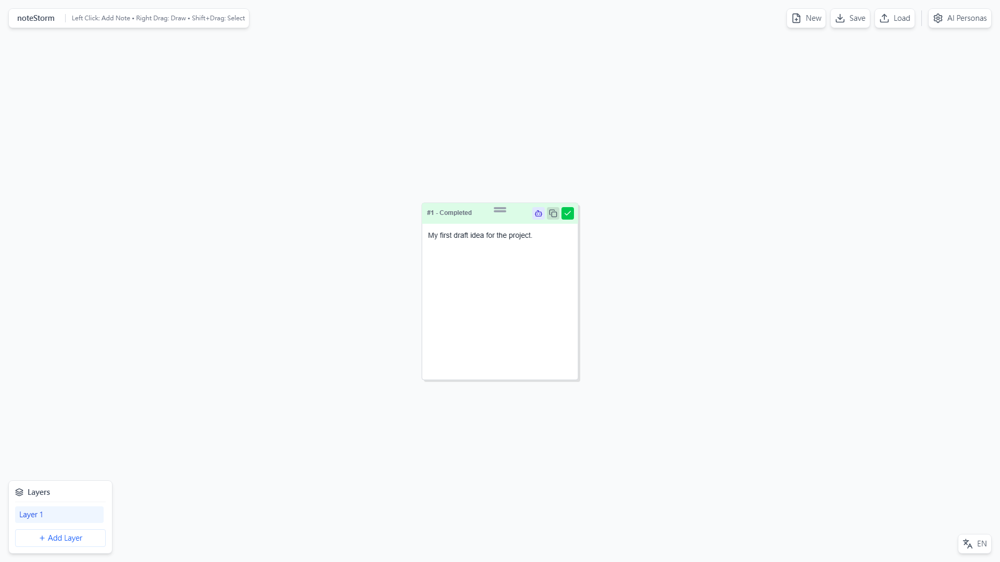
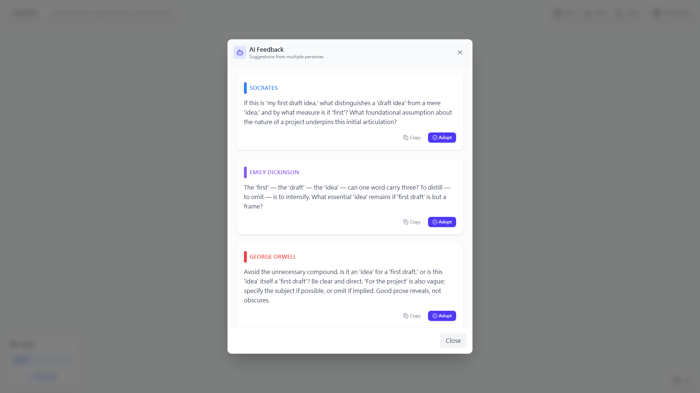
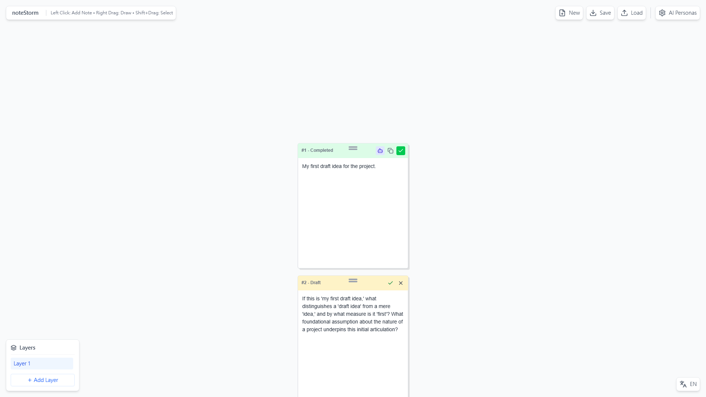

# NoteStorm

**Author:** CodeCity Archie Zhu

---

## Vision

> Every idea deserves to be heard, refined, and realized.

NoteStorm believes great thinking comes from diverse perspectives—and every small idea deserves to be taken seriously.

We start with three default figures: **Socrates** asks questions, **Emily Dickinson** refines with precision, **George Orwell** demands clarity. They dialogue with your ideas. You can freely add more souls—historical figures, thinkers, creators. As you accumulate, adopt, and compare, you continuously gain more diverse perspectives to view every small idea. From fragments to context. From fuzzy to clear.

---

## Highlights

- **Default three figures** — Socrates, Emily Dickinson, George Orwell (question, refine, clarify)
- **Freely add personas** — Introduce any soul that offers advice
- **More diverse perspectives** — Continuously accumulate viewpoints for every small idea
- **Visual whiteboard** — Sticky notes, drawing, layers, groups
- **One-click adopt** — Turn AI suggestions into new notes, iterate fast
- **Privacy-first** — API key stored locally, auto-save in browser
- **Bilingual** — English / 繁體中文

---

## What is NoteStorm?

NoteStorm is a visual note-taking whiteboard that helps you think and write better. AI personas act as your editorial panel.

| You write | AI responds |
|-----------|-------------|
| Add sticky notes, jot down ideas, draw sketches | Press ✓ to get feedback from multiple voices |
| Draft a paragraph, outline, or brainstorm | Each persona offers advice in their own voice |
| Adopt any suggestion you like | It becomes a new note—iterate, compare, find your direction |

**In short:** Start with three default figures. Freely add more. Write, press the checkmark, get advice. Adopt what resonates. Over time, gain more diverse perspectives to view every small idea.

---

## Step-by-Step Guide

### Step 1: Main View



You start with an empty canvas. **Left-click** to add notes. **Right-drag** to draw freehand. **Shift+drag** to select multiple notes, then Create Group. The **Layers** panel (bottom-left) lets you manage multiple boards. Switch language with **EN / 繁中** (bottom-right). Use **New / Save / Load** (top-right) for project files.

---

### Step 2: Configure API Key, Model & AI Personas



Click **AI Personas** (top-right). Enter your **Gemini API Key** (stored locally in your browser). Choose a **model** (e.g., Gemini 2.5 Flash). Add, edit, or remove personas—each has a name, role, and tone. Complete this before using AI features.

---

### Step 3: Add Notes



**Left-click** anywhere on the canvas to create a sticky note. Each note shows its status (Draft / Completed / Disabled) in the header. Type your thoughts in the text area. Drag the header to move the note. Use the **checkmark (✓)** to mark complete, or **X** to disable.

---

### Step 4: Press Checkmark to Request AI Suggestions



When you finish a draft, **press the checkmark (✓)** to request AI suggestions. Your personas (Socrates, Emily Dickinson, George Orwell, or any you added) will respond. A **bot icon** appears when suggestions are ready.

---

### Step 5: View AI Suggestions



Click the **bot icon** on the completed note to open the AI Feedback modal. You'll see feedback from all your personas. Each suggestion has **Copy** (to clipboard) and **Adopt** (create a new note with that content).

---

### Step 6: Adopt a Suggestion



Click **Adopt** on any suggestion to create a new note with that content. The new note appears below the original. The modal closes automatically. Adopt multiple suggestions to build on different ideas.

---

## Features

- **Sticky notes** — Left-click to add, drag to move, type your thoughts
- **Drawing** — Right-drag on canvas to draw freehand
- **Multi-select** — Shift+drag to select, then Create Group
- **Note status** — Draft, Completed, Disabled (✓ or X)
- **AI feedback** — Press checkmark to request suggestions from your personas
- **Adopt & Copy** — Turn suggestions into new notes or copy to clipboard
- **Layers** — Multiple boards, add/switch/delete
- **Project** — New, Save (.wbd), Load
- **AI Personas** — API key, model selection, custom personas
- **Auto-save** — State saved to browser, persists on refresh
- **Bilingual** — English / 繁體中文

## Run Locally

**Prerequisites:** Node.js

1. Install dependencies:
   ```bash
   npm install
   ```

2. **API Key (required)** — Enter your Gemini API key in the app (AI Personas → Gemini API Key).

3. Run the app:
   ```bash
   npm run dev
   ```

4. Open **http://localhost:3000** in your browser.

## Build

```bash
npm run build
```

Output in `dist/`.

## License

Apache-2.0

---

# NoteStorm

**作者：** CodeCity Archie Zhu

---

## 願景

> 讓每個想法都有機會被聽見、被打磨、被實現。

NoteStorm 相信：好的思考來自多元視角，而每一個微小的 idea 都值得被認真對待。

我們從三位預設名人開始：**蘇格拉底** 提問、**艾蜜莉・狄金森** 精準、**喬治・歐威爾** 清晰。他們與你的想法對話。你可以**自由引入**更多靈魂人格—歷史名人、思想家、創作者。隨著你持續累積、採納、對比，你將**不斷獲得更多元的角度去看待每一個微小的 idea**。從碎片到脈絡。從模糊到清晰。

---

## 特色

- **預設三位名人** — 蘇格拉底、艾蜜莉・狄金森、喬治・歐威爾（提問、精準、清晰）
- **自由引入** — 可自訂新增任何能給予建議的靈魂人格
- **更多元的角度** — 不斷累積視角，看待每一個微小的 idea
- **視覺化白板** — 便利貼、手繪、圖層、群組
- **一鍵採用** — AI 建議可直接建立為新筆記，快速迭代
- **隱私優先** — API Key 僅存本機，自動儲存於瀏覽器
- **雙語** — 英文 / 繁體中文

---

## NoteStorm 是什麼？

NoteStorm 是視覺化筆記白板，用 AI 多角色點評幫你寫得更好、想得更清楚。

| 你寫 | AI 回覆 |
|------|----------|
| 建立便利貼、寫下想法、畫草圖 | 按下 ✓ 取得多元觀點的回饋 |
| 寫段落、列大綱、腦力激盪 | 各角色以各自口吻給予建議 |
| 採用你喜歡的建議 | 變成新筆記，對比、取捨、找到方向 |

**一句話：** 預設三位名人與你對話，你可自由引入更多。寫、按打勾、取得建議、採用有共鳴的。最終不斷獲得更多元的角度，去看待每一個微小的 idea。

---

## 逐步操作指南

### 步驟 1：主畫面


從空白畫布開始。**左鍵**新增筆記。**右鍵拖曳**在畫布上繪圖。**Shift+拖曳**多選筆記，可建立群組。左下角 **圖層** 管理多畫布。右下角 **EN / 繁中** 切換語言。右上角 **新增 / 儲存 / 載入** 管理專案檔。

---

### 步驟 2：設定 API Key、選擇模型、設定 AI 人設


點擊右上角 **AI Personas**。輸入 **Gemini API Key**（僅儲存於本機瀏覽器）。選擇 **模型**（如 Gemini 2.5 Flash）。可新增、編輯或刪除角色，每個角色有名稱、角色與語氣。使用 AI 功能前請先完成此步驟。

---

### 步驟 3：添加筆記


在畫布上 **左鍵點擊** 建立便利貼。每張筆記的標題列顯示狀態（草稿 / 完成 / 停用）。在文字區輸入內容。拖曳標題列可移動筆記。點擊 **打勾 (✓)** 標記完成，或 **X** 停用。

---

### 步驟 4：主動按下打勾 請 AI 給予建議


完成草稿後，**按下打勾 (✓)** 請 AI 給予建議。你設定的角色（蘇格拉底、艾蜜莉・狄金森、喬治・歐威爾，或任何你加入的靈魂人格）會回覆。AI 完成後會出現 **機器人圖示**。

---

### 步驟 5：檢視 AI 建議


點擊完成筆記上的 **機器人圖示** 開啟 AI 回饋視窗。可看到各角色的建議。每則建議有 **複製**（複製到剪貼簿）與 **採用**（以該內容建立新筆記）。

---

### 步驟 6：採用建議


點擊任一建議的 **Adopt**，會以該內容建立新筆記，顯示在原筆記下方。視窗會自動關閉。可多次採用不同建議，延伸不同想法。

---

## 功能特色

- **便利貼** — 左鍵新增、拖曳移動、輸入內容
- **畫圖** — 右鍵拖曳畫布可繪製手繪線條
- **多選** — Shift+拖曳框選多張筆記，可建立群組
- **筆記狀態** — 草稿、完成、停用（打勾 ✓ 或 X）
- **AI 建議** — 按下打勾請各角色（可自訂）給予建議
- **採用與複製** — 將 AI 建議建立為新筆記或複製到剪貼簿
- **圖層** — 多畫布、新增／切換／刪除圖層
- **專案** — 新增、儲存 (.wbd)、載入
- **AI 人設** — Gemini API Key、模型選擇、自訂角色
- **自動儲存** — 狀態儲存至瀏覽器，重新整理後保留
- **雙語** — 英文 / 繁體中文

## 本地執行

**環境需求：** Node.js

1. 安裝依賴：
   ```bash
   npm install
   ```

2. **API Key（必填）** — 在應用程式設定中輸入 Gemini API Key（AI 人設 → Gemini API Key）。

3. 啟動應用：
   ```bash
   npm run dev
   ```

4. 在瀏覽器中開啟 **http://localhost:3000**。

## 建置

```bash
npm run build
```

輸出於 `dist/` 目錄。

## 授權

Apache-2.0
